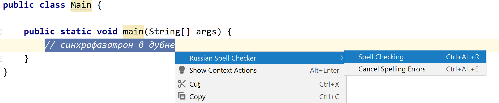
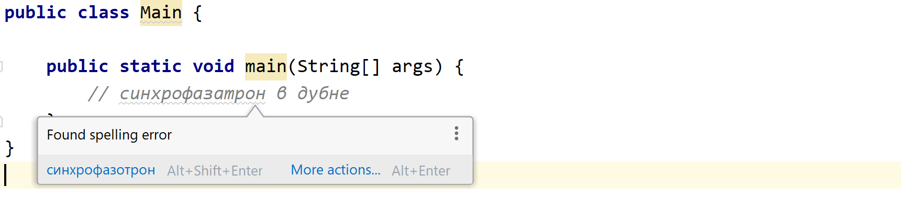
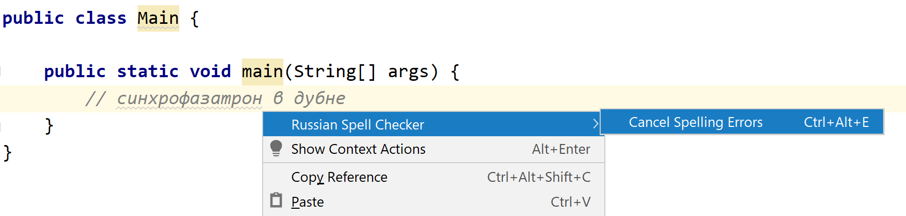

Russian Spell Checker
========

A plugin for Intellij IDEA that give opportunity for spell checking russian text inside code. 

The plugin is using [Yandex Speller](https://yandex.ru/dev/speller/) for russian text spell checking. 
User can call spell checking action from editor context menu for selected text.

Usage
=====

To check the spelling, select the target text inside the editor and call the "Spell Checking" action using:
 - the keyboard shortcut "Alt + Ctrl + R"
 - or use the context popup menu 
 
 
 
To quick fix move cursor to spelling error and use 'quickfix' inside tooltip

To cancel the spelling error:
 - use the keyboard shortcut "Alt + Ctrl + W" 
 - or use the context popup menu 
 

 
Installation
========

Download and install *Russian spell checker* plugin directly from Intellij IDEA:
`Preferences/Settings->Plugins->Browse Repositories`

Alternatively, you can [download the plugin](https://plugins.jetbrains.com/plugin/13763-russian-spell-checker) from the jetbrains plugin site and install it manually in:
`Preferences/Settings->Plugins->Install plugin from disk`

License
=======

    Copyright 2017 Philippe Breault

    Licensed under the Apache License, Version 2.0 (the "License");
    you may not use this file except in compliance with the License.
    You may obtain a copy of the License at

       http://www.apache.org/licenses/LICENSE-2.0

    Unless required by applicable law or agreed to in writing, software
    distributed under the License is distributed on an "AS IS" BASIS,
    WITHOUT WARRANTIES OR CONDITIONS OF ANY KIND, either express or implied.
    See the License for the specific language governing permissions and
    limitations under the License.
